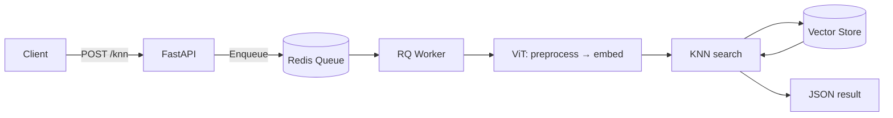

[](http://www.mbari.org)
[](https://github.com/semantic-release/semantic-release)
[](https://opensource.org/licenses/Apache-2.0)
[](https://www.python.org/downloads/)

**fastapi-vss** is a RESTful API for vector similarity search using FastAPI and **Redis**—the fastest vector database available. Redis Stack's in-memory RediSearch delivers sub-millisecond KNN queries. ViT (Vision Transformer) models power image retrieval, rare event mining, anomaly detection, and labeling unlabeled data (e.g., plankton, marine imagery).

**Author:** [Danelle Cline](https://github.com/danellecline)

---

## Architecture

Built on **Redis Stack** (vector store + job queue)—the fastest option for vector similarity workloads. **Project isolation**: each project can use a dedicated Redis instance (host/port) so vector indexes and queues stay separate.

**Batching:** The pipeline is tuned for high-throughput batch inference. Set `BATCH_SIZE` (default 32) via environment variable to match GPU memory. RQ decouples the API from inference so requests enqueue and process asynchronously. Multiple workers run in parallel (one per project), and preprocessing uses a thread pool for parallel image loading.

## Workflow



**Flow:** Client uploads images → API enqueues job, returns `job_id` → Client polls `GET /predict/job/{job_id}/{project}` → Worker runs ViT inference, searches Redis KNN → Result returned.

## Features

- **Redis**—fastest vector database available; sub-ms KNN over embeddings
- Foundational (DINO) or fine-tuned ViT models trained with the Huggingface trainer: https://github.com/mbari-org/vitstrain
- **Batch processing**—configurable `BATCH_SIZE` (env var), async RQ, parallel workers; top-n search
- Docker, OpenAPI docs, URL-based config override

## Configuration

YAML config files are loaded from the `CONFIG_PATH` directory. By default this is the `config/` directory at the project root. Override by setting the `CONFIG_PATH` environment variable.

Basic example that define the redis server and a single model:

```yaml
# config_testproject1.yaml
# This config references a foundational model
redis:
  host: "redis-stack-vss"
  port: 6379
vss:
  model: "google/vit-base-patch16-224"
  project: "testproject1"
  output_path: "/data/vss/outputs/testproject1"
```

For multiple models, add multipls config files per each project, e.g.

```yaml
# config_testproject2.yaml
# This config uses a locally stored model
redis:
  host: "redis-stack-vss"
  port: 6379
vss:
  model: "/mnt/models/CFE/cfe_isiis_dino_v7-20250916/"
  project: "testproject2"
  output_path: "/data/vss/outputs/testproject2"
```

Add `config_url: "https://..."` to merge remote config (remote overrides local). Timeout 30s.

---


## Related

- Train your own ViTS model using the Huggingface trainer: https://github.com/mbari-org/vitstrain
