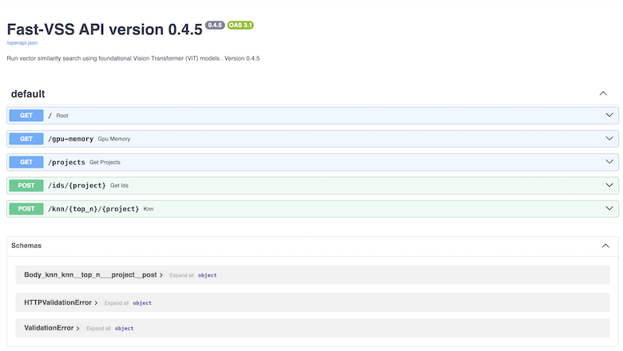

**fastapi-vss** A RESTful API for vector similarity search.  It uses the Python web framework [FastAPI](https://fastapi.tiangolo.com/). 

This accelerates machine learning workflows that require visual similarity search using foundational models.

--- 

---

## Related work
 
* https://github.com/mbari-org/aidata
