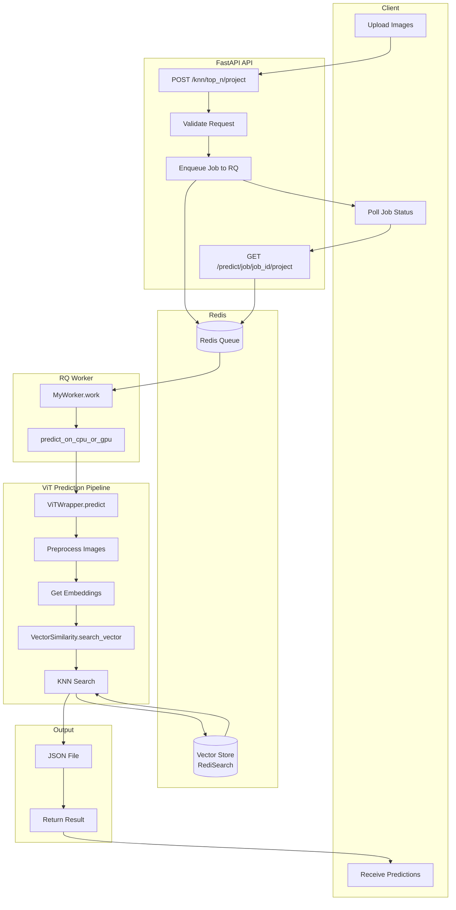
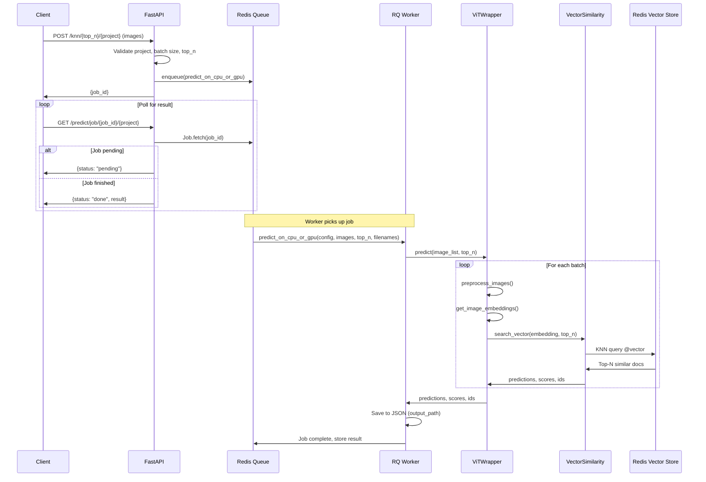

# FastAPI-VSS Workflow

## System Architecture & Data Flow

```mermaid
flowchart TB
    subgraph Client["Client"]
        A[Upload Images]
        B[Poll Job Status]
        C[Receive Predictions]
    end

    subgraph FastAPI["FastAPI API"]
        D[POST /knn/top_n/project]
        E[Validate Request]
        F[Enqueue Job to RQ]
        G[GET /predict/job/job_id/project]
    end

    subgraph Redis["Redis"]
        H[(Redis Queue)]
        I[(Vector Store<br/>RediSearch)]
    end

    subgraph RQWorker["RQ Worker"]
        J[MyWorker.work]
        K[predict_on_cpu_or_gpu]
    end

    subgraph ViTPipeline["ViT Prediction Pipeline"]
        L[ViTWrapper.predict]
        M[Preprocess Images]
        N[Get Embeddings]
        O[VectorSimilarity.search_vector]
        P[KNN Search]
    end

    subgraph Output["Output"]
        Q[JSON File]
        R[Return Result]
    end

    A --> D
    D --> E
    E --> F
    F --> H
    F --> B
    B --> G
    G --> H
    H --> J
    J --> K
    K --> L
    L --> M
    M --> N
    N --> O
    O --> P
    P --> I
    I --> P
    P --> Q
    Q --> R
    R --> C
```

## KNN Request Sequence

```mermaid
sequenceDiagram
    participant C as Client
    participant API as FastAPI
    participant RQ as Redis Queue
    participant W as RQ Worker
    participant ViT as ViTWrapper
    participant VS as VectorSimilarity
    participant Redis as Redis Vector Store

    C->>API: POST /knn/{top_n}/{project} (images)
    API->>API: Validate project, batch size, top_n
    API->>RQ: enqueue(predict_on_cpu_or_gpu)
    API->>C: {job_id}

    loop Poll for result
        C->>API: GET /predict/job/{job_id}/{project}
        API->>RQ: Job.fetch(job_id)
        alt Job pending
            API->>C: {status: "pending"}
        else Job finished
            API->>C: {status: "done", result}
        end
    end

    Note over RQ,W: Worker picks up job
    RQ->>W: predict_on_cpu_or_gpu(config, images, top_n, filenames)
    W->>ViT: predict(image_list, top_n)

    loop For each batch
        ViT->>ViT: preprocess_images()
        ViT->>ViT: get_image_embeddings()
        ViT->>VS: search_vector(embedding, top_n)
        VS->>Redis: KNN query @vector
        Redis->>VS: Top-N similar docs
        VS->>ViT: predictions, scores, ids
    end

    ViT->>W: predictions, scores, ids
    W->>W: Save to JSON (output_path)
    W->>RQ: Job complete, store result
```
 
  
